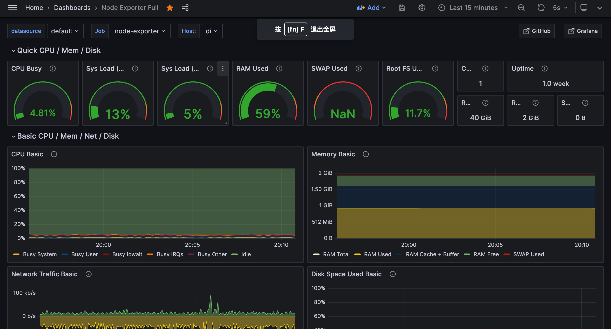
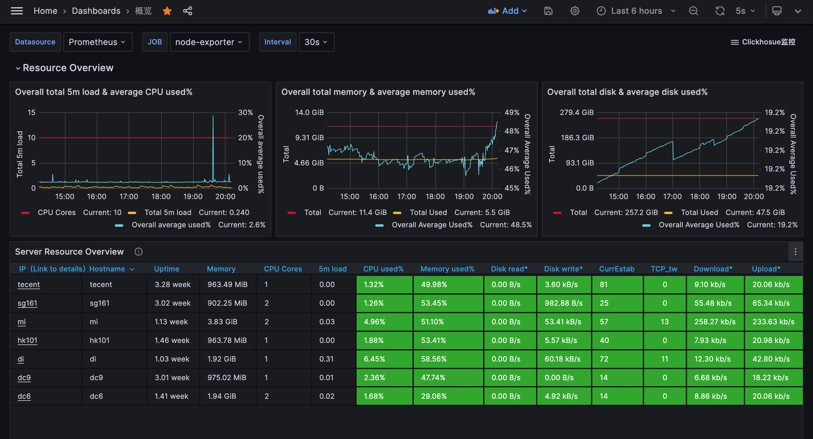

## 使用node-exporter + prometheus + grafana 监控k8s集群

| 组件 | 镜像 |
| --- | --- |
| node-exporter | v1.6.1 |
| prometheus | v2.45.0 |
| grafana | 10.0.3 |

安装：

```bash
kubectl create namespace monitoring
kubectl apply -f k3s/node-exporter.yaml
kubectl apply -f k3s/prometheus.yaml
kubectl apply -f k3s/grafana.yaml 
watch kubectl get pod -n monitoring -o wide
```

卸载：

```bash
kubectl delete namespace monitoring
```

### node-exporter

node-exporter用来获取机器指标，包括CPU、内存、磁盘、网络等，并将这些指标暴露在 `/metrics` 上，供prometheus抓取。

PS：这里使用hostNetwork来监控Host的网络堆栈。

### prometheus

主要关注ConfigMap中的prometheus.yaml。最核心的是两部分：kubernetes的服务发现和relabel_config。下面是prometheus的文档。

1. [kubernetes_sd_config](https://prometheus.io/docs/prometheus/latest/configuration/configuration/#kubernetes_sd_config)
2. [relabel_config](https://prometheus.io/docs/prometheus/latest/configuration/configuration/#relabel_config)

在node-exporter任务的relabel_config的部分，我们优先使用Node的ExternalIP作为__address__的ip部分，如果ExternalIP不存在则使用InternalIP。

可以访问 http://{{LoadBalancerIP:9090}}/targets?search= 查看服务发现的的抓取目标

### grafana

为了将grafana暴露到公网，Service的Type为LoadBalancer。如果K8S集群没有LoadBalancer实现的话，可以改成NodePort，或者Deployment中使用hostPort或hostNetwork。

端口是3000，默认用户名密码是admin。设置datasource为 http://prometheus-service.monitoring:9090 。

推荐的grafana大盘模版：https://grafana.com/grafana/dashboards/1860-node-exporter-full/。在新建大盘时选择import，并输入1860即可。

还有概览页大盘模版：[overview.json](./overview.json)

效果图：





### 进阶优化

如果想优化下默认的配置，可以有这几个方向：

1. 使用PersistentVolume来存储prometheus的tsdb和Grafana的大盘等配置。
2. 给Grafana配置TLS证书